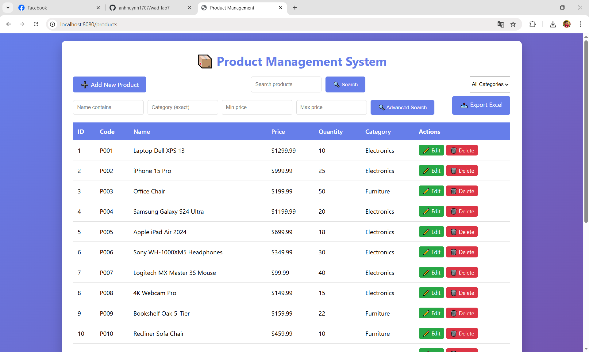
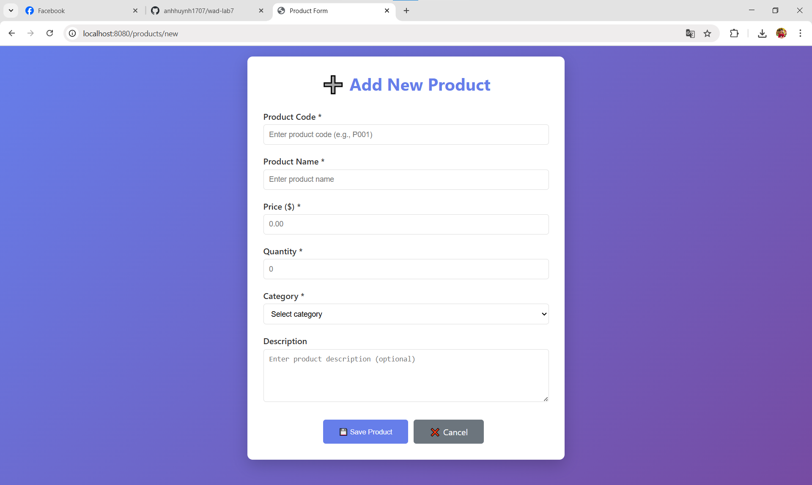
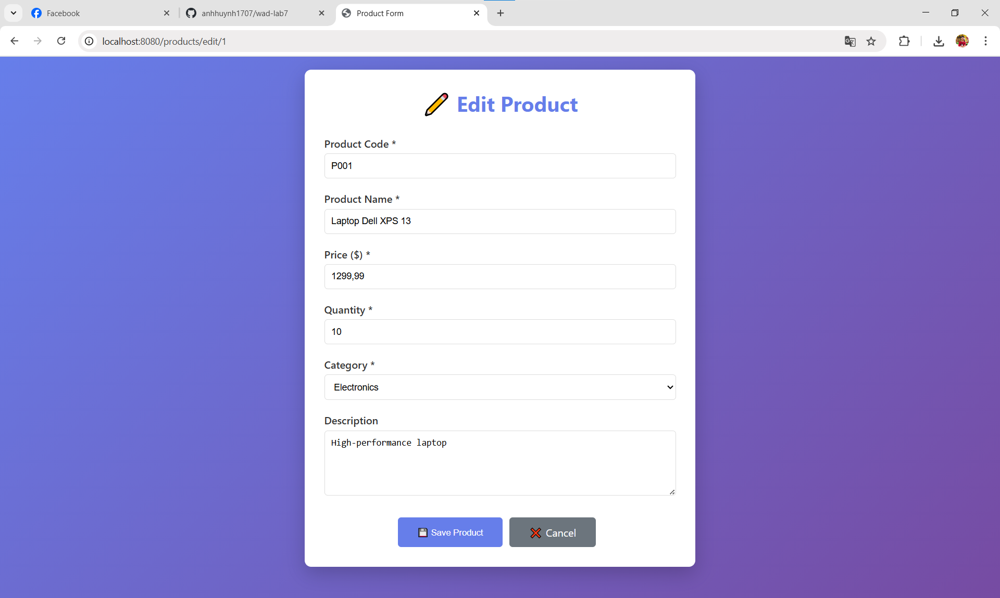
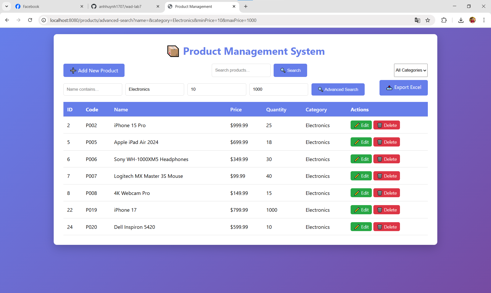
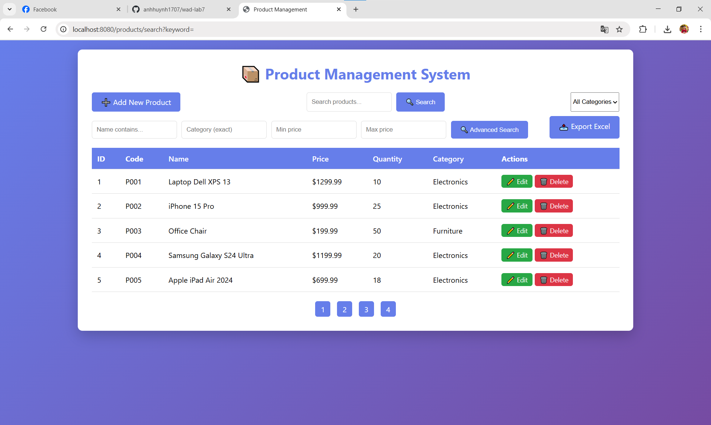
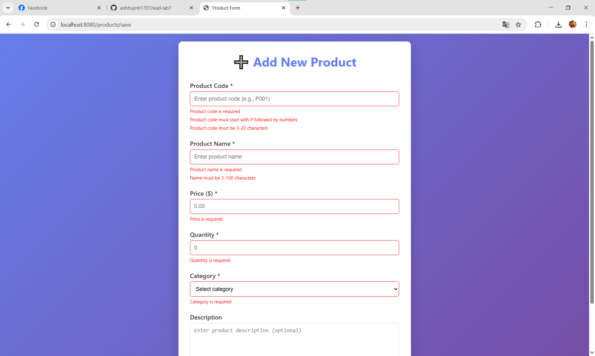
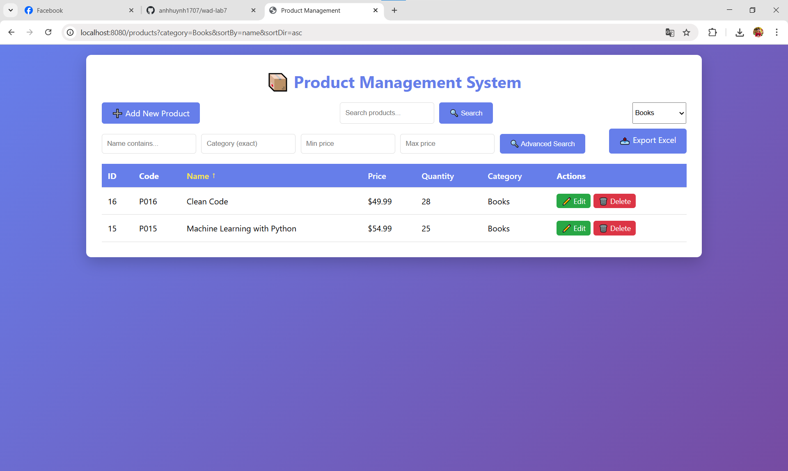

# Product Management System

## Student Information
- **Name:** Huỳnh Tuấn Anh
- **Student ID:** ITITIU23003
- **Class:** Web Application Development_Group01_lab03_Tue1234

## 💻 Technologies Used
- Spring Boot 3.3.x
- Spring Data JPA
- MySQL 8.0
- Thymeleaf
- Maven

## 🔨 Setup Instructions
1. Import project into VS Code
2. Create database: `product_management`
3. Update `application.properties` with your MySQL credentials
4. Run: `mvn spring-boot:run`
5. Open browser: http://localhost:8080/products

## Completed Features
- [x] CRUD operations
- [x] Search functionality
- [x] Advanced search with filters
- [x] Validation
- [x] Sorting
- [x] Pagination
- [x] REST API (Bonus)
- [ ] Image Upload (Bonus)
- [x] Export to Excel (Bonus)

## 📄 Project Structure
```
entity/       - JPA entities
repository/   - Data access layer
service/      - Business logic layer
controller/   - Web controllers
templates/    - Thymeleaf views
```
## Database Schema
See `product_management.sql` for database structure.

## ❗ Known Issues
- I am confused because of working with Spring Boot and Maven for the first time (I did not know that when editing the pom.xml, we need to shut down the project for editing and then restart it).
- Taking more time to understand how a Spring Boot project works (controller, services, repository, the "@" sign for mapping, validation, etc).
- A little bit of struggle when using git in the terminal.
- Understanding how the REST API works.

## ⌚ Time Spent
Approximately 7.5 hours

## Screenshots
### The homepage of 📦 Product Management System 

---
### ➕ Add product form

---
### ✏️ Edit product form

---
### 🔎 Advanced search products with Electronics category, minPrice = 10, maxPrice = 1000

---
### 🔎 Search with pagination

---
### ✔ Validation when adding or editing a product

---
### 🧪 Sorting and filtering with the Books category in ascending order

---
